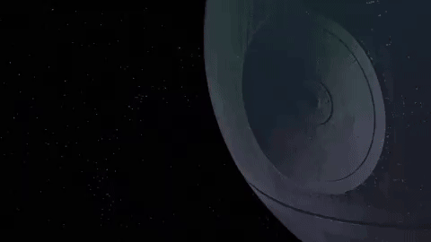

# DEATHSTAR
### A system for confirming planets and identifying false positive signals in TESS data using ground-based time domain surveys

### Created by Gabrielle Ross
### Last updated 2/19/2024

Please see this **Google Doc** for the most up-to-date documentation: **[https://docs.google.com/document/d/1XhSLHx4Errv8sN3Wgqgwl7IM7kJosu0pbtIqBg6fUhQ/edit](https://docs.google.com/document/d/1XhSLHx4Errv8sN3Wgqgwl7IM7kJosu0pbtIqBg6fUhQ/edit)**

Please **cite our paper** if you use this code: **[https://ui.adsabs.harvard.edu/abs/2023MNRAS.tmp.3722R/abstract](https://ui.adsabs.harvard.edu/abs/2023MNRAS.tmp.3722R/abstract)**
